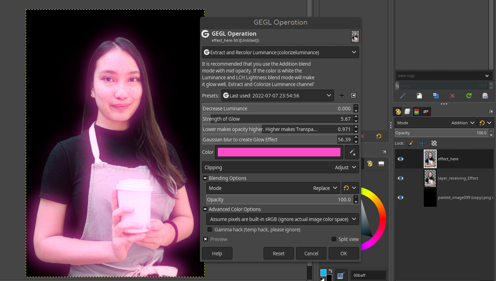

# GEGL Extract and Color Luminance Channel
GEGL Extracts the brightness channel from an image and colorizes and blurs it. This filter was inspired by Gimp/GEGL's "Bloom" and Pixelitor's "Extract channel" filter. It shows that GEGL has the ability to extract channels for non-destructive editing with blend modes.  Filter requires an alpha channel
and it is highly recommended you use the blend mode addition.

